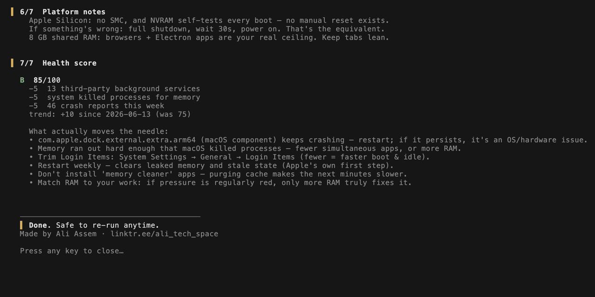

# MacTune

> The honest macOS tune-up. It measures what is actually slow, fixes only what is safe and reversible, and tells you the truth when the answer is "close some tabs" — because no cache cleanup will ever beat an honest diagnosis.

[](https://github.com/Ali-expandings/mactune/actions/workflows/ci.yml)
[](LICENSE)


<p align="center">
  <strong>More reverse engineering, mobile security, and tech breakdowns:</strong>
</p>

<p align="center">
  <a href="https://www.youtube.com/@who_tf_is_ali">
    
  </a>
  <a href="https://www.instagram.com/ali_the_tech_butcher/">
    
  </a>
  <a href="https://linktr.ee/ali_tech_space">
    
  </a>
</p>

One self-contained bash script. Runs on the `/bin/bash` every Mac ships (bash 3.2), from macOS 11 Big Sur through macOS 26 Tahoe, Apple Silicon and Intel. No dependencies, no daemon, no telemetry, nothing resident — it runs, reports, and exits.


## Install

**curl** (recommended — no sudo needed):

```sh
curl -fsSL https://raw.githubusercontent.com/Ali-expandings/mactune/main/install.sh | sh
```

Want a double-clickable launcher on your Desktop too (no terminal needed after this)?

```sh
curl -fsSL https://raw.githubusercontent.com/Ali-expandings/mactune/main/install.sh | sh -s -- --desktop
```

**Homebrew:**

```sh
brew install ali-expandings/mactune/mactune
```

**Manual** (it's one file):

```sh
curl -fsSL https://raw.githubusercontent.com/Ali-expandings/mactune/main/mactune -o /usr/local/bin/mactune
chmod +x /usr/local/bin/mactune
```

Uninstall: `rm $(command -v mactune)` — plus `rm -r ~/.config/mactune` if you want the saved answers and score history gone too. That's the whole footprint.

## Usage

```
mactune              full run: diagnose → safe maintenance → score
mactune --dry-run    read-only: show everything it would do, change nothing
mactune --yes        accept every optional step
mactune --no-sudo    skip the admin section entirely
mactune --rollback   undo mactune's UI tweaks (restore animations & transparency)
mactune --reset      forget saved answers, ask everything again
```

On first run it asks how to handle optional steps: ask each time, yes to everything, or **save my answers** — answer each prompt once and every future run reuses your choices.

## What it measures (the part that matters)

Most "Mac cleaners" delete caches and call it speed. Apple's own slow-Mac guidance and Howard Oakley's macOS internals writing point somewhere else entirely, and that is where MacTune measures:

- **Memory pressure** — the correct metric (not "free RAM", which macOS keeps low by design), plus a live swap-rate sample to catch active thrashing in the act.
- **Memory by app, truthfully** — a modern browser is 30+ helper processes; per-process lists undercount the real owners. MacTune sums them per app, which is the question you actually opened Activity Monitor to ask.
- **Jetsam events** — did macOS force-kill anything for memory this week? That is RAM running out, recorded.
- **Disk: fullness, hotspot map, and SMART health** — where the space went (Trash, Downloads, caches, iPhone backups, Docker images, DerivedData), and whether the disk itself is dying — the slowdown nobody checks for.
- **Battery health** (laptops) — capacity %, cycle count, condition; macOS quietly caps performance when a battery can't deliver power.
- **Stability scan** — crash reports from the last 7 days with the most frequent crasher named; kernel panics flagged as the hardware/driver red flags they are.
- **"Slow right now" detection** — Spotlight mid-index, Time Machine mid-backup, WindowServer working overtime: the honest explanations for today's slowness.
- **Thermal throttling** — real Intel SMC readings; real `powermetrics` sampling on Apple Silicon. Never a fake "OK" on a platform that doesn't expose the number.
- **Startup load** — login items and third-party background services, counted, not guessed.
- **Is it even the Mac?** — optional 20-second Apple `networkQuality` test, because half of "my Mac is slow" is the internet.

Everything measured feeds a **health score (0–100, graded A–F)** where every lost point is traceable to a measurement. Each run appends to `~/.config/mactune/history.csv`, so the next run shows your trend.

## What it fixes (only the safe part)

- Broken login agents whose programs no longer exist (unloaded, plist → Trash)
- QuickLook thumbnail cache refresh, DNS resolver cache flush
- Developer caches **when present and large** — npm, Xcode DerivedData, pip, Yarn, pnpm, Cargo — each opt-in and moved to Trash *whole*, so it's recoverable until you empty the Trash (unlike the tools' own one-way `clean` commands)
- Optional UI mode: Reduce Transparency/Motion (measurably lighter on WindowServer; one `--rollback` away from stock)
- Admin section (opt-in): Time Machine snapshot thinning, `purge` **only under genuine memory pressure** (otherwise it's placebo that slows the next minutes), Spotlight reindex **only when search is measurably slow**, Low Power Mode report

## What it will never do

This is the actual product. The rules a tool must follow when it doesn't know your machine:

- **Never** disables Apple services, daemons, or indexing
- **Never** blanket-purges caches "for speed" (that's how cleaners *cause* slowness)
- **Never** touches security settings, SIP, Gatekeeper, or FileVault
- **Never** deletes user data — file removals go to Trash, recoverable
- **Never** runs in the background, phones home, or installs anything resident
- **Never** asks for sudo without telling you exactly what for, and runs fully without it

## Scoring

| Finding | Points |
|---|---|
| Memory pressure critical / elevated | −30 / −15 |
| Actively swapping right now | −15 |
| Disk ≥90% / ≥85% full | −25 / −10 |
| Disk SMART failing | −40 |
| Kernel panic this week | −15 |
| Jetsam (system killed processes for memory) | −5 |
| Runaway process (≥80% CPU) | −10 |
| Thermal throttling / pressure | −10 |
| Battery condition not Normal / capacity <80% | −10 / −5 |
| No restart in 14+ days | −5 |
| 8+ login items / 12+ third-party services | −5 / −5 |
| 6+ crash reports this week | −5 |

90+ A · 80+ B · 70+ C · 55+ D · below F



## MacTune vs. the cleaner apps

If you're looking for a free, open-source alternative to CleanMyMac-style cleaners, the honest difference is the order of operations:

| | MacTune | Typical cleaner app |
|---|---|---|
| Price | Free, MIT | $30–50/year |
| Source | One bash file, readable in a sitting | Closed binary |
| First move | Measure: memory pressure, SMART, jetsam, battery | Delete caches |
| The big number | 0–100 score, every point traced to a measurement | "GB freed" that refills itself by tomorrow |
| Deletions | To Trash, recoverable | Usually gone |
| Lives on your Mac | Nothing resident, runs and exits | Menu-bar agent + background services |
| When the problem is hardware | Says so | Sells you more cleaning |

## FAQ

**Why does it ask before almost everything?**
Because the safe default on an unknown machine is *no*. `--yes` exists when you trust it; "save my answers" exists so you only decide once.

**Does cleaning caches speed up a Mac?**
Mostly no — caches exist to make things faster, and purging them makes the next minutes slower. MacTune only offers cache cleanup where it returns meaningful *disk space* (developer caches measured in the hundreds of MB or GB), and says so honestly.

**Why bash 3.2?**
It's the `/bin/bash` every Mac has shipped since 2007. Zero install friction, works on a fresh machine out of the box, auditable in one file.

**It says my real problem is RAM/disk/battery. Can't it fix that?**
No, and neither can any app — that's the point. The most valuable thing a diagnostic can do is stop you from buying placebo.

## Credits

Created and maintained by **Ali Assem** — [YouTube](https://www.youtube.com/@who_tf_is_ali) · [Instagram](https://www.instagram.com/ali_the_tech_butcher/) · [Linktree](https://linktr.ee/ali_tech_space)

Built on the published guidance of [Apple Support](https://support.apple.com/) ("If your Mac runs slowly") and the macOS internals writing of [Howard Oakley / The Eclectic Light Company](https://eclecticlight.co/), with techniques surveyed (and placebo filtered out) from the open-source Mac maintenance ecosystem, notably [tw93/mole](https://github.com/tw93/mole).

## License

[MIT](LICENSE)
